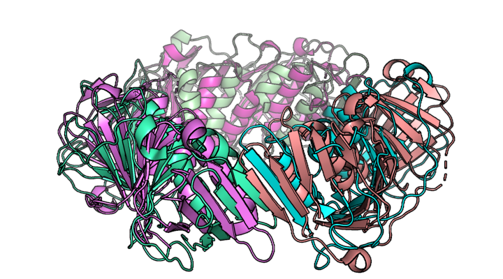

# QS-ALIGN: protein quaternary structure alignment

QS-align is a scalable protein quaternary structure alignment algorithm.



### What can this tool be used for?

Have you ever needed to compare two protein complexes? 
Would you like to know which subunits from two protein assemblies are equivalent?

Traditional quaternary structure alignment methods combinatorially evaluate all possible chain-chain mappings between the two protein complexes. 
Although this approach works for comparisons of small protein complexes (up to 3 subunits), the computing time scales exponentially with the size of the input structures and rapidly becomes prohibitively expensive. 
**QS-align** provides a scalable solution to this problem, so that any two protein complexes can be efficiently compared.

### What's in this repository?

This repository contains the command-line interface (CLI) to the **QS-align** algorithm.
The source code is included in the structure module of the [BioJava library](https://github.com/biojava/biojava) from version 5, and can be found [here](https://github.com/biojava/biojava/tree/master/biojava-structure/src/main/java/org/biojava/nbio/structure/align/quaternary).

### How does the algorithm work?

The algorithm is fully described and tested in *Chapter 4* of my Master thesis:

>Lafita A. Assessment of protein assembly prediction in CASP12 & Conformational dynamics of integrin α‐I domains. ETH Zürich. 2017;99. Available at: https://doi.org/10.3929/ethz-a-010863273

There is a [pull request](https://github.com/biojava/biojava/pull/571) to BioJava that contains the source code of the algorithm and additional description of the method.

### Download

The latest version of the **QS-align** CLI tool is available from the [releases section](https://github.com/lafita/qs-align/releases).
**QS-align** only requires [Java 8](https://www.java.com/en/download/) or higher.

### Run QS-align

You can ask for help to check the options of the CLI.
```
java -jar qs-align_X.X.jar -h

usage: java -jar QsAlign.jar [options]
 -h,--help            Print usage information
 -t,--target <file>   Model of the first Structure [required]
 -q,--query <file>    Model of the second Structure [required]
 -o,--output <file>   Path to the output file [default: stdout]
```

To align two protein complexes, specify a target and query structures and (optionally) an output file.
```
java -jar qs-align_X.X.jar -t 1bcc -q 1kb9 -o result.tsv
```

### Supported input formats

1. Structures can be downloaded directly from the Protein Data Bank (PDB), simply specify their PDB codes.
```
java -jar qs-align_X.X.jar -t 1bcc -q 1kb9 -o result.tsv
```
2. In the case of crystal structures, using the PDB code will download the asymmetric unit of the crystal. If you want to use the biological assembly add a `BIO:` prefix and the biological assembly number as a suffix (e.g. `:1`).
```
java -jar qs-align_X.X.jar -t BIO:1bcc:1 -q BIO:1kb9:1 -o result.tsv
```
3. Local files in [PDB](https://www.rcsb.org/pdb/static.do?p=file_formats/pdb/index.html), [PDBx/mmCFIF](http://mmcif.wwpdb.org/) and [MMTF](https://mmtf.rcsb.org) formats. 
```
java -jar qs-align_X.X.jar -t 1bcc.pdb -q 1kb9.cif -o result.tsv
```

Any combination of inputs is allowed (e.g. align the structure from a local file against a remote structure in the PDB).
```
java -jar qs-align_X.X.jar -t 1bcc.mmtf -q BIO:1kb9:1 -o result.tsv
```

### Output format

The output is a single row of Tab-separated values with their headers, like the one below:

```
Query	Target	Relation		ChainLength	RMSD	ResidueLength	[Aligned-Query]			[Aligned-Target]		[Query-Target:OrientationAngle]
1kb9	1bcc	PARTIAL_INCOMPLETE	8		2.25	1561		[A, B, C, D, F, G, H, I]	[A, B, C, D, H, F, G, J]	[ A-A:0.04 B-B:0.13 C-C:0.02 D-D:0.04 F-H:0.09 G-F:0.01 H-G:0.08 I-J:0.06 ]
```

The meaning of the headers for each value are:

- `Query` and `Target`: PDB codes or file names of the two aligned protein structures.
- `Relation`: specifies the outcome of the alignment and can be:
   - `EQUIVALENT`: both protein complexes have the same number of chains and they all match.
   - `PARTIAL_COMPLETE`: one complex has fewer chains than another and they all match. This means that one of the complexes is a subset of the other, and the other contains additional chains.
   - `PARTIAL_INCOMPLETE`: the number of matching chains is lower than the number of chains in either of the complexes. This means that each complex has additional chains not found in the other complex.
   - `DIFFERENT`: the two complexes do not share any common protein chains.
- `ChainLength`: the number of matching chains, included in the alignment.
- `RMSD`: the root mean square deviation (RMSD) at the residue level of the quaternary structure superposition.
- `ResidueLength`: the total number of aligned residues, summing up the residues in each chain in the alignment.
- `[Aligned-Query]`: a comma separated list of the matching chain IDs of the query structure.
- `[Aligned-Target]`: a comma separated list of the matchig chain IDs of the target structure.
- `[Query-Target:OrientationAngle]`: a comma separated list of query vs target chain-chain matchings, with the angular deviation in radians of the chain orientations in the quaternary structure superposition.


### Build from source

To build the tool from source, clone this repository and run a Maven install.
All other Java dependencies, including **BioJava** will be downloaded and installed by Maven.

```
clone https://github.com/lafita/qs-align.git
cd qs-align
mvn install
```

The newly generated **JAR** executable will be placed in the `target` directory:

```
target/qs-align-X.X-SNAPSHOT.jar
```

Apache Maven is a software project management tool.
More information about Maven and instructions on how to install it can be found at https://maven.apache.org.


### Contact

If you have any questions or problems, you can [post a new issue](https://github.com/lafita/qs-align/issues/new) in this repository.


### Cite this work

This method is not published in a peer-reviewed journal article, but if you found the tool useful for your research, please consider citing my thesis:

>Lafita A. Assessment of protein assembly prediction in CASP12 & Conformational dynamics of integrin α‐I domains. ETH Zürich. 2017;99.(available at: https://doi.org/10.3929/ethz-a-010863273)

You can also mention the link to this repository, using the URL https://github.com/lafita/qs-align. 

Thank you!

